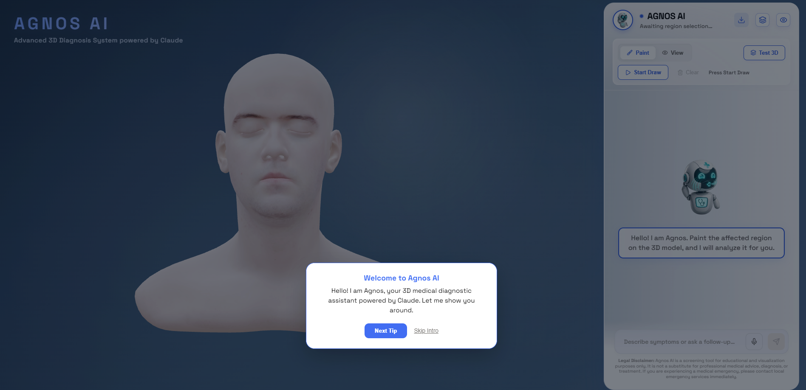
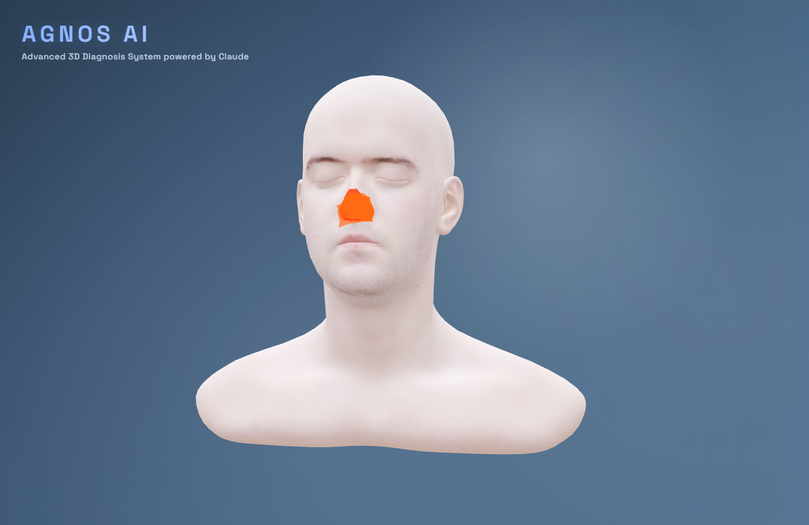
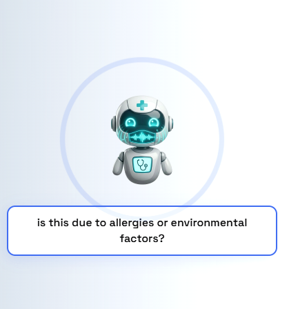
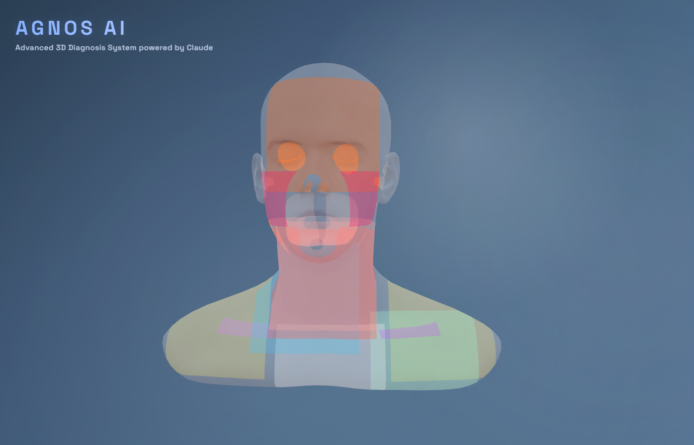
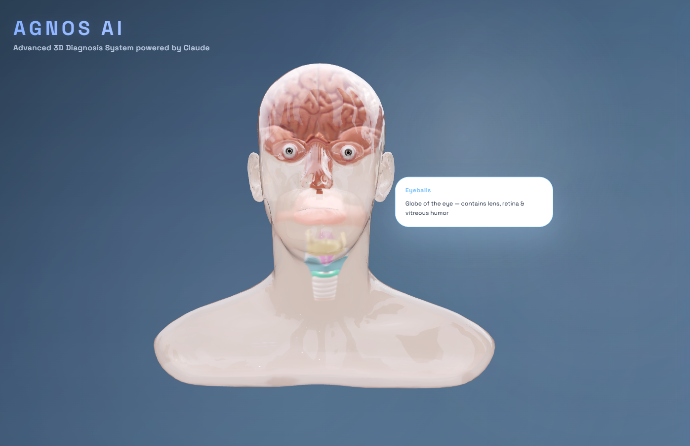

# AGNOS AI: Advanced 3D Anatomical Symptom Mapping

AGNOS AI is an interactive diagnostic platform designed to provide a spatial and technical bridge between patient symptoms and anatomical understanding. By utilizing a high-fidelity 3D interface, users can map their physical discomfort directly onto a digital human model, enabling more precise communication of symptoms than traditional text-based interfaces.



## Overview & Background

The core challenge in remote healthcare or digital symptom assessment is the "descriptive gap." Patients often struggle to articulate the exact location, depth, and nature of their pain to a standard chatbot. AGNOS AI solves this by making **3D mapping the primary mode of interaction**. Instead of describing a "headache," a user can precisely mark the supraorbital region or the temporal fascia, allowing for a more granular starting point for clinical analysis.

## Key Features

### 3D Symptom Mapping
The central interface allows users to rotate, inspect, and "paint" symptomatic regions directly onto the model. This spatial data is then processed to identify specific anatomical zones, providing a technical baseline for the diagnostic assessment.



### Intelligent AI Diagnostics
Once a region is marked, the integrated Agnos AI—powered by the Claude LPU™ and specialized medical prompt engineering—analyzes the mapped metadata. It provides concise, professional, and warm feedback via synchronized text and speech.



### Anatomical Layering & Subtitles
To facilitate a deeper understanding, the system offers visualization toggles for muscles, internal organs, and specialized 3D subsystems like the ocular and laryngeal structures. 




## Ethical Considerations

AGNOS AI is built with a commitment to responsible AI deployment and patient safety:

*   **Clinical Guardrails**: If the system detects symptoms synonymous with life-threatening conditions (e.g., severe chest pain or neurological indicators), it is programmed to prioritize an immediate recommendation for professional emergency care.
*   **Medical Disclaimer**: The platform explicitly maintains its status as an educational and visualization tool, ensuring users understand it is not a substitute for professional medical advice.
*   **Bias Mitigation**: The AI is prompted to consider physiological diversity—including age, gender identity, and skin tone—to ensure that feedback remains objective and unbiased across different demographics.
*   **Privacy First**: The current architecture is designed for local processing of coordinates, minimizing the storage of sensitive personal health information (PHI) within the primary application layer.

## Technical Architecture

*   **Logic & Rendering**: React with Three.js (via React Three Fiber and Drei) for high-performance 3D visualization and decal mapping.
*   **Natural Language Processing**: Anthropic's Claude 3.5 Sonnet API for high-accuracy, low-latency diagnostic reasoning.
*   **Human-Computer Interaction**: Web Speech API for seamless browser-native text-to-speech output, ensuring high availability and zero-cost accessibility.
*   **Data Export**: PDF generation module for session summaries, allowing users to take their mapped data to a healthcare provider.

## Installation and Setup

To run AGNOS AI locally, ensure you have Node.js installed on your system.

1.  **Clone the repository**:
    ```bash
    git clone https://github.com/yourusername/agnos-ai.git
    cd agnos-ai
    ```

2.  **Install dependencies**:
    ```bash
    npm install
    ```

3.  **Environment Configuration**:
    Create a `.env` file in the root directory and add your API keys:
    ```env
    VITE_CLAUDE_API_KEY=your_claude_api_key
    VITE_ELEVENLABS_API_KEY=your_elevenlabs_api_key
    ```
    *Note: The platform is configured to securely utilize the ElevenLabs ultra-low-latency `eleven_turbo_v2_5` TTS model alongside native HTML5 blob audio synchronization.*

4.  **Execute development server**:
    ```bash
    npm run dev
    ```

Navigate to `http://localhost:5173` to interact with the platform.
